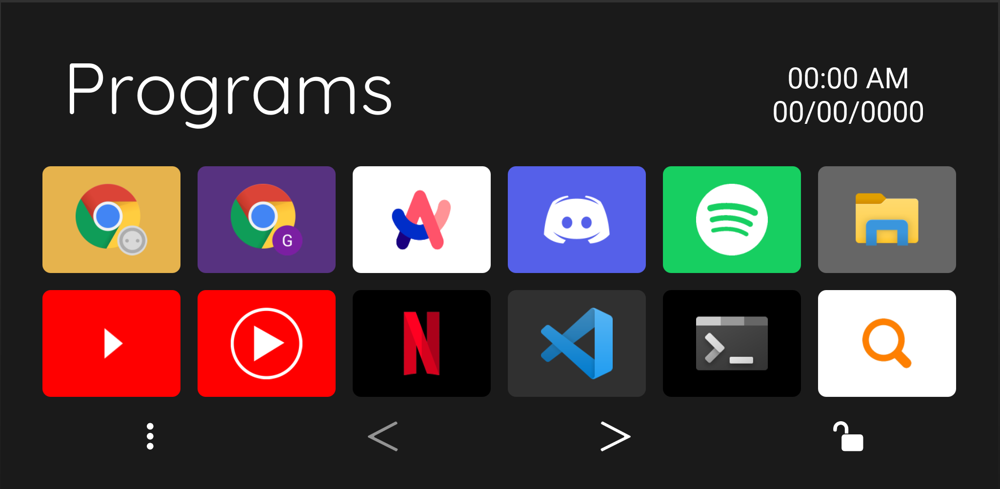
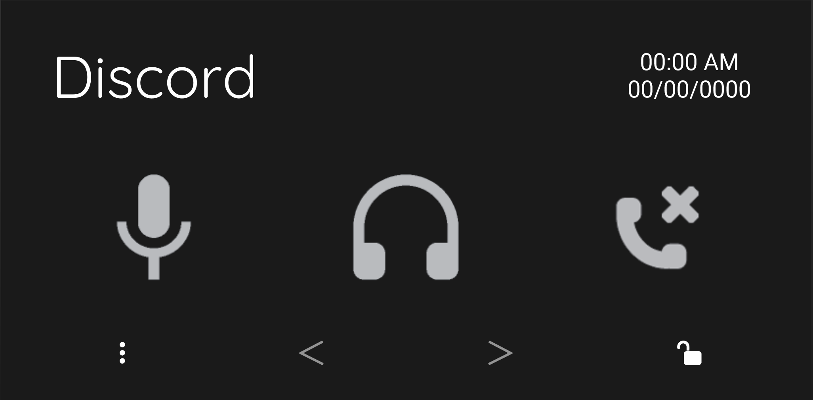
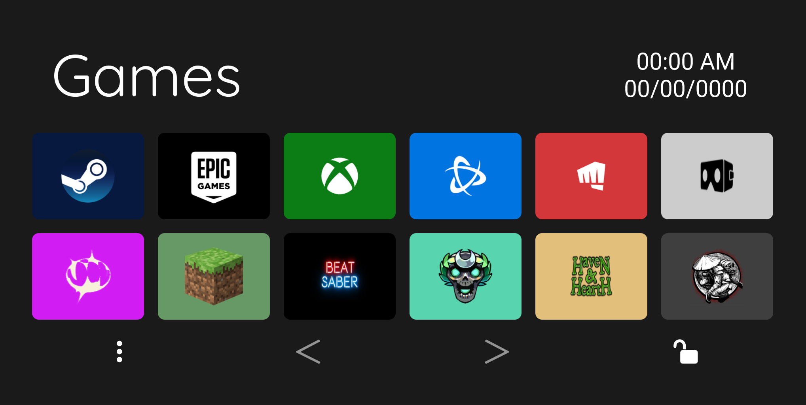

# GBE Dotfiles

This is my personal development environment — terminal themes, VS Code setup, Touch Portal macros, and more.

While this setup is highly personalized, parts of it may be useful to anyone looking to build their own modular, dark-mode-friendly workspace.

## Contents

```
GBE-DOTFILES/
├── oh-my-posh/                # Shell & terminal config
│   └── gbe-theme.omp.json    # Oh My Posh theme
│
├── Touch Portal Icons/      # All custom icon sets
│   ├── Adobe/                # Adobe apps & tools (includes 3rd-party Arbi set)
│   ├── Discord/              # Voice control icons
│   ├── File Explorer/        # Navigation + drive icons
│   ├── Games/                # Launcher & game icons
│   ├── Icons/                # Arrows, locks, misc UI
│   ├── Internet/             # Browser functions & shortcuts
│   ├── Programs/             # App icons (VS Code, Slack, etc.)
│   ├── Spotify/              # Playback icons
│   └── Zoom/                 # Meeting controls
├── touch-portal/            # Touch Portal pages & screenshots
│   ├── Adobe Tools/          # Illustrator, Photoshop tools
│   ├── Coding Tools/         # JavaScript, Language switchers
│   ├── Discord/              # Voice and call controls
│   ├── File Explorer/        # Folder nav, drive shortcuts
│   ├── Games/                # Game launchers
│   ├── Main Menu/            # Navigation hub
│   ├── Programs/             # Most-used apps
│   ├── Spotify/              # Music controls
│   ├── Web Browser/          # Tab management + quick access
│   ├── Zoom/                 # Meeting controls
│   ├── gbe-all-pages.tpz2    # Full backup of all pages
│   └── gbe-clock.tpz2        # Standalone clock plugin page
│
├── vscode/                 # Editor setup
│   ├── settings.json        # Font, theme, layout, etc.
│   └── extensions.txt       # List of installed extensions
│
└── README.md               # You're here!
```

# Terminal Prompt (Oh My Posh)


## Install Oh My Posh

If you **don't have Oh My Posh installed**, download it here: [Oh My Posh](https://ohmyposh.dev/)

1. Follow the installation guide for your system (**Windows, macOS, Linux**).
2. Verify the installation:

```bash
oh-my-posh --version
```

## Installing my theme

- Theme: `gbe-theme.omp.json`
- Built for dark mode with vibrant segments (hostname, directory, time, git status, etc.)

To apply:

```bash
oh-my-posh init bash --config ~/path/to/gbe-theme.omp.json | source
```

# Touch Portal Setup

## Navigation & Lock Logic:

- Arrows (`<`, `>`) move between multi-page sections.
- Tap the page title to return to the **Main Menu**, unless the page is locked.
- Lock 🔒 / Unlock 🔓 buttons toggle whether the tablet stays on a page.
- **Automatic page switching** only works on **Windows**.

## Required Plugins:

- [Timezones Plugin (Clock)](https://www.christophecvb.com/touch-portal/plugins/timezones) — Displays live time and date on all pages.
- [Discord Plugin](https://github.com/spdermn02/TouchPortal_Discord_Plugin) — Controls mute, deafen, and calls.
- [Spotify Plugin](https://www.christophecvb.com/touch-portal/plugins/spotify) — Spotify playback controls.

## Custom Pages Overview:

- **Coding Tools** – Launches automatically with VS Code. Choose a language like HTML, CSS, JavaScript, etc.

  - **JavaScript** has full macros built out for declarations, loops, conditionals, methods, and array functions across two pages.

- **Discord** – Opens with Discord. Uses this plugin to handle mute, deafen, and call controls.

- **Spotify** – Opens with Spotify. Uses this plugin to auto-fill album art, song title, artist name, and control everything:

  - Play/pause, skip, rewind, volume, mute/unmute, heart toggle, shuffle, and repeat modes.

- **Adobe Tools** – Opens with Photoshop or Illustrator. Switch between Photoshop tools, Photoshop actions, and Illustrator tools for quick-access workflows.

- **Zoom** – Opens with Zoom. Offers meeting controls for mute, camera toggle, chat view, audience view, hang up, and join call.

- **Games** – Opens with Steam. Displays common game launchers and favorite game shortcuts.

  - Touching _Programs_ is a quick shortcut to jump into your games.

## Notable Pages (with Screenshots):

<table>
  <tr>
    <td align="center">
      <br/>
      <strong>Programs</strong>
    </td>
    <td align="center">
      <br/>
      <strong>Web Browser</strong>
    </td>
  </tr>
  <tr>
    <td align="center">
      <br/>
      <strong>Discord</strong>
    </td>
    <td align="center">
      <br/>
      <strong>File Explorer</strong>
    </td>
  </tr>
  <tr>
    <td align="center">
      <br/>
      <strong>Games</strong>
    </td>
    <td align="center">
      <br/>
      <strong>Main Menu</strong>
    </td>
  </tr>
</table>

# VS Code Setup

## Font

- Uses **Comic Code**: [Comic Code by Toshi Omagari](https://tosche.net/fonts/comic-code)
- Optional: swap for Fira Code, JetBrains Mono, etc. if unavailable.

## Install Extensions:

```bash
cat vscode/extensions.txt | xargs -n 1 code --install-extension
```

## Apply Settings:

Copy `vscode/settings.json` to:

- **Windows**: `%APPDATA%\Code\User\settings.json`
- **Mac/Linux**: `~/.config/Code/User/settings.json`

# Wallpaper Engine Setup

This setup uses **two dynamic wallpapers** that switch based on time:

## Wallpapers

1. **Swirl (Light Theme)**

   - [Steam Workshop ID: 2568658643](https://steamcommunity.com/sharedfiles/filedetails/?id=2568658643)

2. **Black (Dark Theme)**
   - [Steam Workshop ID: 2604686890](https://steamcommunity.com/sharedfiles/filedetails/?id=2604686890)

## Schedule

- **9:30 PM**: Switches to **Black** (Dark Theme)
- **7:00 AM**: Switches back to **Swirl** (Light Theme)

# Color Settings

### Swirl (Light Theme):

- **Background Color**: `#2476fe`
- **Color 1**: `#ffffff`
- **Color 2**: `#321ffe`

### Black (Dark Theme):

- **Background Color 1**: `#141414`
- **Background Color 2**: `#141414`
- **Particle Color**: `#4c98f6`
- **Line Color**: `#0066ff`

## Applying the Setup

1. **Download both wallpapers** via the provided Workshop links.
2. Replace your **Wallpaper Engine config** with the provided `config.json`:
   - Path: `C:/Program Files (x86)/Steam/steamapps/common/wallpaper_engine/config/config.json`
3. Restart **Wallpaper Engine** to apply.

> ⚠️ **Warning**: Replacing the config will overwrite your current Wallpaper Engine schedules and preferences.

# Touch Portal Icons

This repo includes a full suite of **Touch Portal icons**, grouped into folders by usage (Adobe, Games, Zoom, etc.). Most are custom or adapted for clarity and consistency.

# Attribution:

- **Adobe/Arbi Photoshop Tools Pack/** — Icons by **Arbi Barbarona**

  - Facebook: [arbibarbarona](https://www.facebook.com/arbibarbarona)
  - Original `info.txt` included in the folder.

- **Discord/Discord Vanilla Icon Pack/** — Icons by **BreezyBat**
  - Twitch: [breezybat](https://twitch.tv/breezybat)
  - Original `info.txt` included in the folder.
  - _Modified by me to remove backgrounds for transparency._

> ⚠️ Most icons are intended for **personal use only**. Avoid redistributing without checking original sources.

# Notes

- This is a **work in progress** — I constantly refine and evolve the setup.
- Icons in Touch Portal are for **personal use only**.
- The Touch Portal **automatic page switching** feature only works on **Windows**.

# Credits

Crafted by **Gabe** — a workspace built for speed, comfort, and dark mode aesthetics. Remix, borrow, or take inspiration freely. If you use it, I'd love to see how you make it your own!
