# 📁 GBE Dotfiles

This is my personal development environment — terminal themes, VS Code setup, Touch Portal macros, and more.

While this setup is highly personalized, parts of it may be useful to anyone looking to build their own modular, dark-mode-friendly workspace.

This setup is constantly evolving and still a work in progress.

## Contents

```
GBE-DOTFILES/
├── oh-my-posh/              # Shell & terminal config
│
├── touch-portal/            # Touch Portal files
│   ├── touch-portal-pages/     # Touch Portal pages
│   │   ├── Adobe Tools/          # Illustrator, Photoshop tools
│   │   │   ├── Illustrator/
│   │   │   └── Photoshop/
│   │   ├── Coding Tools/         # Coding snippets for specific coding langauges
│   │   │   ├── CSS/
│   │   │   ├── GIT/
│   │   │   ├── HTML/
│   │   │   ├── JavaScript/
│   │   │   ├── Mark-Down/
│   │   │   ├── Python/
│   │   │   ├── Regex/
│   │   │   ├── SQL/
│   │   │   └── Terminal/
│   │   ├── Discord/              # Voice and call controls
│   │   ├── File Explorer/        # Folder nav, drive shortcuts
│   │   ├── Games/                # Game launchers
│   │   ├── Main Menu/            # Navigation hub
│   │   ├── Programs/             # Most-used apps and dev tools
│   │   ├── Spotify/              # Music controls
│   │   ├── Web Browser/          # Tab management + quick access
│   │   │   ├── Youtube/            # Playback and Video Controls
│   │   │   └── Youtube Music/      # Playback and Music Controls
│   │   ├── Zoom/                 # Meeting controls
│   │   ├── gbe-all-pages.tpz2    # Full backup of all pages
│   │   └── gbe-clock.tpz2        # Standalone clock plugin page
│   └── touch-portal-icons/     # PNG images used for buttons
│       ├── Adobe/                # Adobe app icons
│       │   ├── Illustrator Tools/  # Illustrator specifc tools
│       │   └── Photoshop Tools/    # Photoshop specifc tools
│       ├── Discord/              # Mic, headphone, call icons
│       ├── File Explorer/        # Drive, folder icons
│       ├── Games/                # Game and launcher icons
│       ├── Programs/             # VS Code, Slack, etc.
│       ├── Spotify/              # Playback icons
│       ├── System Icons/         # Arrows, locks, UI indicators
│       ├── Web Browser/          # Browser tools
│       └── Zoom/                 # Video conferencing icons
│
├── vscode/                 # Editor setup
│   ├── settings.json        # Font, theme, layout, etc.
│   └── extensions.txt       # List of installed extensions
│
├── wallpaper-engine/       # Dynamic wallpaper settings
│   └── config.json           # Settings for wallpaper engine
│
└── README.md               # You're here!
```

# >\_ Terminal Prompt (Oh My Posh)

Oh My Posh is a prompt theme engine for any shell, designed to make your terminal more informative and visually appealing.

Download it here: [Oh My Posh](https://ohmyposh.dev/)

My theme focuses on dark mode compatibility with vibrant segments that highlight key info like the current directory, Git status, and time.

## Installing my theme

Download and find `gbe-theme.omp.json` in the `oh-my-posh` folder

To apply:

```bash
oh-my-posh init bash --config ~/path/to/gbe-theme.omp.json | source
```

## Structure

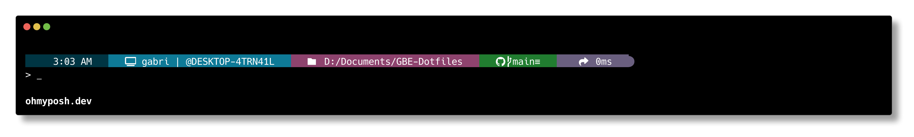

Segment Breakdown:

1. Time of command

2. Username & Hostname

3. Current directory

4. Git branch & status (if in a repo)

5. Execution time (for the last command)

## Git Branch and Status Color Legend

| **Color**     | **Trigger**                           | **Meaning**                                                    |
| ------------- | ------------------------------------- | -------------------------------------------------------------- |
| **Green**     | No changes / clean repo               | Everything is **up-to-date** and clean.                        |
| **Orange**    | Uncommitted changes (working/staging) | You’ve got **local changes** not staged or committed.          |
| **Purple**    | Ahead                                 | You have **local commits** to push.                            |
| **Dark Blue** | Behind                                | Remote has **commits to pull**.                                |
| **Red**       | Ahead _and_ behind                    | You’re **out of sync**—both local and remote have new commits. |

# 📱 Touch Portal Setup

Touch Portal is a macro control app that turns any phone or tablet into a customizable control deck for your PC.

Download it here: [Touch Portal](https://www.touch-portal.com/)

My setup focuses on workflow automation for common, repetitive tasks while providing a visual shortcut system to streamline daily workflow.

## Custom Pages Overview:

- **Programs** - Default page that opens when there isn't a designated page.

  - Access all of your favorite Programs at a touch

- **Web Browser** - Opens with Google Chrome. Manage tabs and access quick links:

  - New Tab New Window, Back, Refresh, Incognito Mode, and Close Tab controls.

  - Quick launch shortcuts for YouTube, YouTube Music, Netflix, Reddit, Amazon, and Twitch.

- **YouTube & YouTube Music** – Opens with the respective web apps or browser tab with a interface for playback control:

  - Play/pause, skip forward/backward, rewind 10s, fast-forward 10s, volume up/down, and mute toggle.

- **Coding Tools** – Opens with VS Code. Access a wide range of snippet pages for each major language:

  - **HTML** – Tags for structure (div, class, headings, paragraphs, anchor tags, buttons, scripts, and boilerplate).

  - **CSS** – Property snippets for layout (Flexbox, Grid), spacing (margin, padding), styling (color, background), and positioning (z-index, display, position).

  - **JavaScript** – Two full pages covering declarations, loops, conditionals, class methods, console logs, and flow control blocks (if, else, for, while, etc.).

  - **Python** – Quick-insert for print, variables, functions, loops, if/else, imports, and common statements like return, input(), and dictionary usage.

  - **Regex** – Prebuilt patterns for digits, word characters, whitespace, boundaries, groups, and special lookahead/lookbehind structures.

  - **SQL** – Query snippets including SELECT, INSERT, UPDATE, DELETE, WHERE, JOIN, ORDER BY, and table creation/modification.

  - **GIT** – Essential commands: commit, push, pull, status, branch creation, checkout, clone, and stash.

  - **Terminal** – Common shell commands: list files, change directory, make/remove folders, clear terminal, print path, and run scripts.

  - **Mark Down** – Headers, formatting (bold, italic), links, images, inline/code blocks, and smart buttons for dynamic numbered lists and growing tables.

  - Easily navigate between languages and back to the Coding Languages menu at any time.

- **Discord** – Opens with Discord. Uses a plugin to handle mute, deafen, and call controls.

- **Spotify** – Opens with Spotify. Uses a plugin to auto-fill album art, song title, artist name, and control everything:

  - Play/pause, skip, rewind, volume, mute/unmute, heart toggle, shuffle, and repeat modes.

- **Adobe Tools** – Opens with Photoshop or Illustrator. Switch between Photoshop tools, Photoshop actions, and Illustrator tools for quick-access workflows.

- **Zoom** – Opens with Zoom. Offers meeting controls for mute, camera toggle, chat view, audience view, hang up, and share screen.

- **Games** – Opens with Steam. Displays common game launchers and favorite game shortcuts.

  - Access your games quickly by touching the tiltle in the _Programs_ page.

- **File Explorer** - Openes with file explorer. Quick navigation for file management:

  - Adds functions as buttons like: New Folder, New Window, Rename, Preview pane, and Properties

  - Shortcuts to PC, Downloads, Documents, and Drives (C:, D:, E:)

- **Main menu** - Serves as a hub connecting all pages together

  - Can be accessed on any page by clicking the three vertical dots on the bottom left

## Navigation & Lock Logic:

- **Automatic page switching** takes you to the correct page when its corresponding window is active.

  - Only works on **Windows**.

- Tap the page title to return to the **Default Page**.

- Lock 🔒 / Unlock 🔓 buttons toggle whether the tablet stays on a page.

- Arrows (`<`, `>`) move between multi-page sections.

## Required Plugins:

- [Timezones Plugin (Clock)](https://www.christophecvb.com/touch-portal/plugins/timezones) — Displays live time and date on all pages.
- [Discord Plugin](https://github.com/spdermn02/TouchPortal_Discord_Plugin) — Controls mute, deafen, and calls.
- [Spotify Plugin](https://www.christophecvb.com/touch-portal/plugins/spotify) — Spotify playback controls.

## Screenshots:

<table>
  <tr>
    <td align="center">
      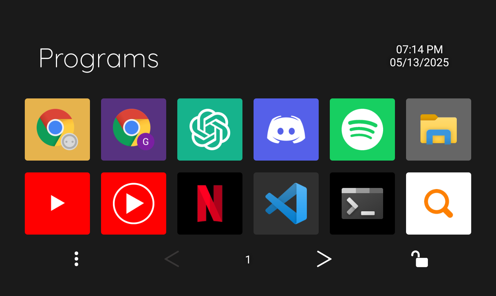<br/>
      <strong>Programs</strong>
    </td>
    <td align="center">
      <br/>
      <strong>Web Browser</strong>
    </td>
  </tr>
  <tr>
    <td align="center">
      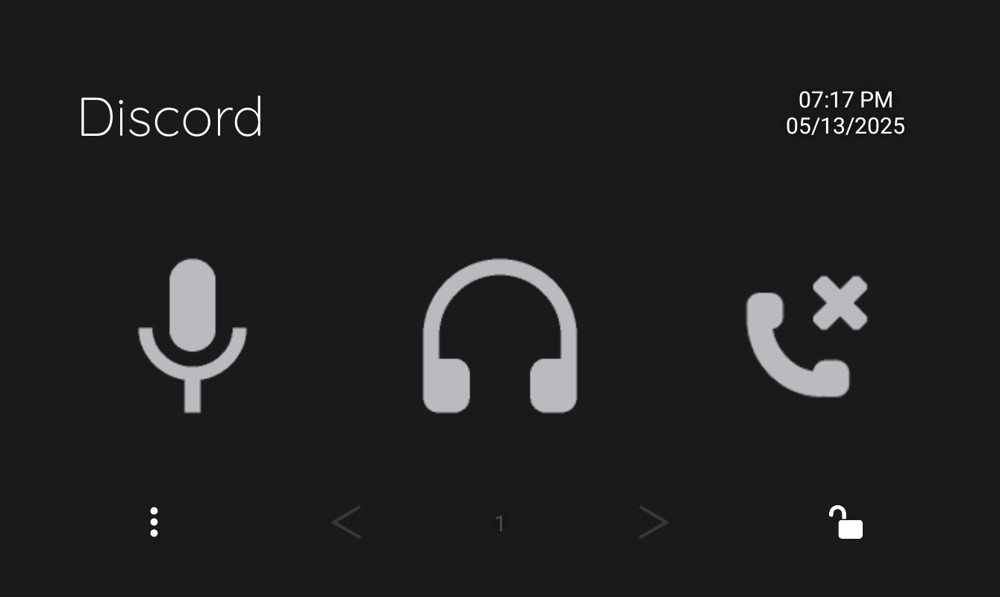<br/>
      <strong>Discord</strong>
    </td>
    <td align="center">
      <br/>
      <strong>File Explorer</strong>
    </td>
  </tr>
  <tr>
    <td align="center">
      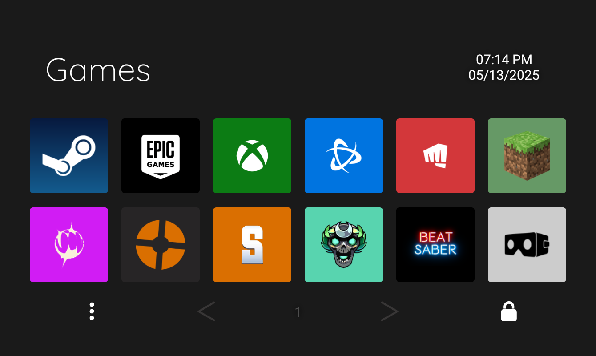<br/>
      <strong>Games</strong>
    </td>
    <td align="center">
      <br/>
      <strong>Main Menu</strong>
    </td>
  </tr>
  <tr>
    <td align="center">
      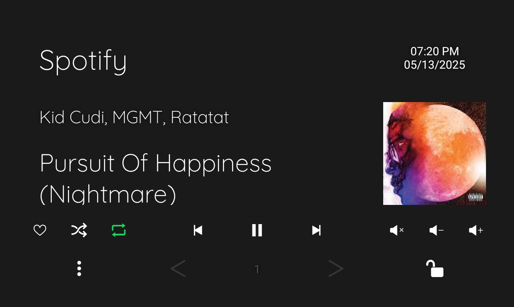<br/>
      <strong>Spotify</strong>
    </td>
    <td align="center">
      <br/>
      <strong>YouTube</strong>
    </td>
  </tr>
</table>

> **Note:** Some icons may appear distorted in the **Touch Portal Windows app**, but display correctly on **Android** and **iOS** devices.

# 🖼️ Touch Portal Icons

This repo includes a full suite of **Touch Portal icons**, grouped into folders by usage (Adobe, Games, Zoom, etc.). Most are custom or adapted for clarity and consistency.

## Icon Preview & Color Guide

This guide provides a visual overview of all icons, along with recommended background colors for each one.  
It serves as both a style reference and a quick way to ensure consistency across your Touch Portal layout.

Icons are grouped by category, and hex codes are included for easy customization.  
Use this guide to stay visually organized or tweak it to match your personal theme.

<details> 
<summary style="font-size: 1.5em; font-weight: 600">Programs</summary>
<table>
  <tr>
    <td align="center">
        </br>
        <span style="background-color:#E6B34D; color:black; padding: 5px; border-radius: 5px;">Chrome #E6B34D</span>
     </td>
    <td align="center">
        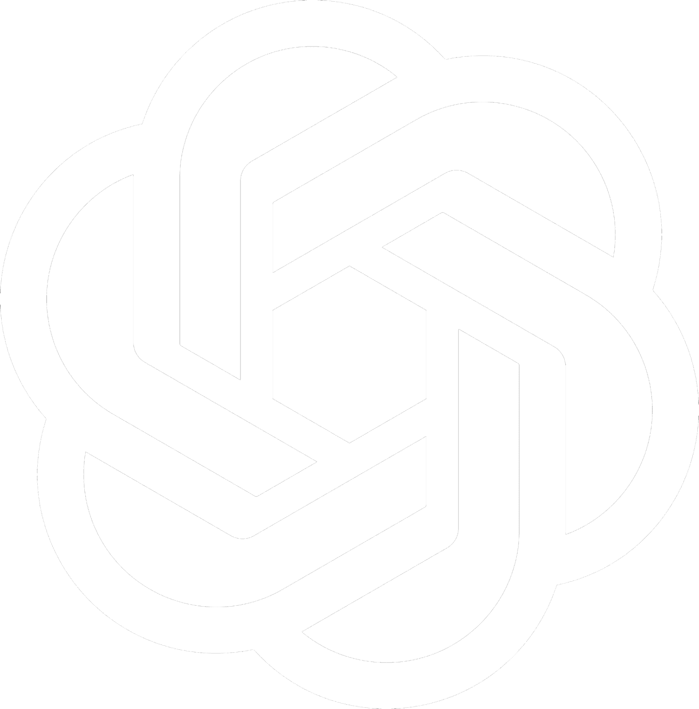</br>
        <span style="background-color:#16B38C; color:black; padding: 5px; border-radius: 5px;">ChatGPT #16B38C</span>
    </td>
    <td align="center">
        </br>
        <span style="background-color:#5560E9; color:black; padding: 5px; border-radius: 5px;">Discord #5560E9</span>
    </td>
    <td align="center">
        </br>
        <span style="background-color:#17CF61; color:black; padding: 5px; border-radius: 5px;">Spotify #17CF61</span>
    </td>
  </tr>
  <tr>
    <td align="center">
        </br>
        <span style="background-color:#666666; color:white; padding: 5px; border-radius: 5px;">File Explorer #666666</span>
    </td>
    <td align="center">
        </br>
        <span style="background-color:#666666; color:white; padding: 5px; border-radius: 5px;">VS Code (Color) #666666</span>
    </td>
    <td align="center">
        </br>
        <span style="background-color:#2EA3F1; color:black; padding: 5px; border-radius: 5px;">VS Code (White) #2EA3F1</span>
    <td align="center">
        </br>
        <span style="background-color:#000000; color:white; padding: 5px; border-radius: 5px;"> Terminal #000000</span>
    </td>
  </tr>
  <tr>
    <td align="center">
        </br>
        <span style="background-color:#FFFFFF; color:black; padding: 5px; border-radius: 5px;">Everything #FFFFFF</span>
    </td>
    <td align="center">
        </br>
        <span style="background-color:#1E1E1E; color:white; padding: 5px; border-radius: 5px;">Touch Portal #1E1E1E</span>
    </td>
    <td align="center">
        </br>
        <span style="background-color:#1A3399; color:white; padding: 5px; border-radius: 5px;">Firefox #1A3399</span>
    <td align="center">
        </br>
        <span style="background-color:#FFFFFF; color:black; padding: 5px; border-radius: 5px;">Arc #FFFFFF</span>
    </td>
  </tr>
  <tr>
    <td align="center">
        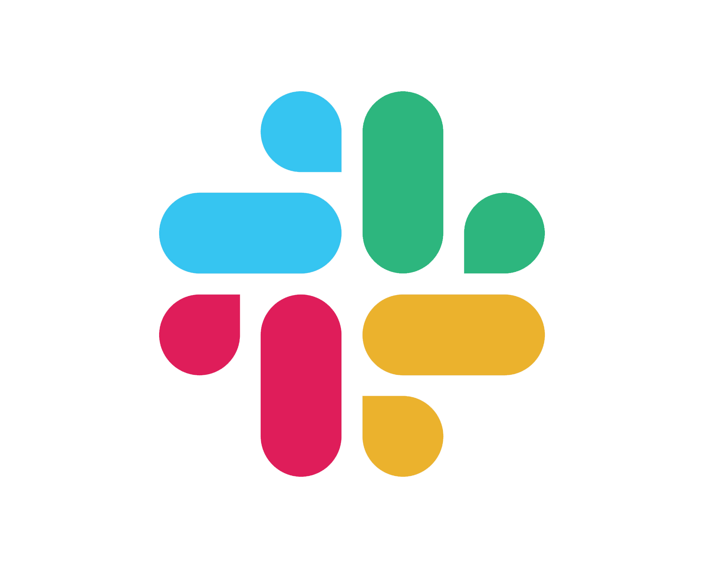</br>
        <span style="background-color:#FFFFFF; color:black; padding: 5px; border-radius: 5px;">Slack #FFFFFF</span>
    </td>
    <td align="center">
        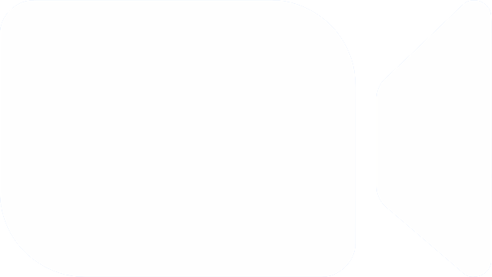</br>
        <span style="background-color:#518EF7; color:white; padding: 5px; border-radius: 5px;">Zoom #518EF7</span>
    </td>
    <td align="center">
        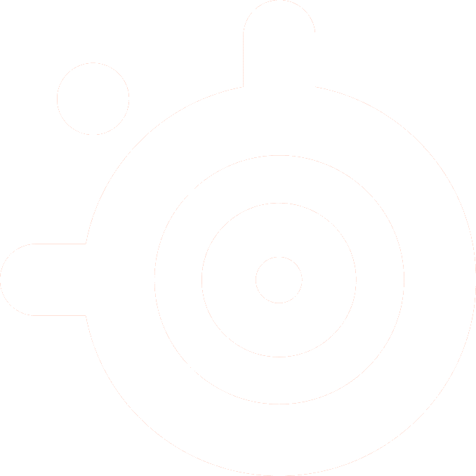</br>
        <span style="background-color:#FF511B; color:white; padding: 5px; border-radius: 5px;">Steel Series #FF511B</span>
    <td align="center">
        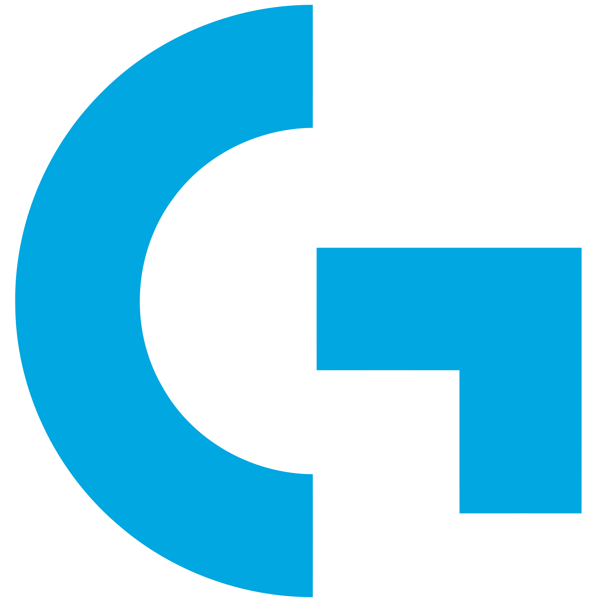</br>
        <span style="background-color:#FFFFFF; color:black; padding: 5px; border-radius: 5px;">Logitech #FFFFFF</span>
    </td>
  </tr>
</table>
</details>

<details> 
<summary style="font-size: 1.5em; font-weight: 600">Adobe</summary>
<table>
  <tr>
    <td align="center">
        </br>
        <span style="background-color:#001733; color:white; padding: 5px; border-radius: 5px;">Photoshop #001733</span>
     </td>
    <td align="center">
        </br>
        <span style="background-color:#310101; color:white; padding: 5px; border-radius: 5px;">Illustrator #310101</span>
     </td>
    <td align="center">
        </br>
        <span style="background-color:#450035; color:white; padding: 5px; border-radius: 5px;">Xd #450035</span>
     </td>
    <td align="center">
        </br>
        <span style="background-color:#72172E; color:white; padding: 5px; border-radius: 5px;">Indesign #72172E</span>
     </td>
  </tr>
  </table>
</table>
</details>

<details>
<summary style="font-size: 1.5em; font-weight: 600">Internet</summary>

Web Shortcuts

<table>
  <tr>
    <td align="center">
        </br>
        <span style="background-color:#F79400; color:white; padding: 5px; border-radius: 5px;">Amazon #F79400</span>
     </td>
    <td align="center">
        </br>
        <span style="background-color:#ffffff; color:black; padding: 5px; border-radius: 5px;">Gmail #ffffff</span>
     </td>
    <td align="center">
        </br>
        <span style="background-color:#000000; color:white; padding: 5px; border-radius: 5px;">Netflix #000000</span>
     </td>
    <td align="center">
        </br>
        <span style="background-color:#FF3F18; color:white; padding: 5px; border-radius: 5px;">Reddit #FF3F18</span>
     </td>
     </tr>
  <tr>
    <td align="center">
        </br>
        <span style="background-color:#6C2498; color:white; padding: 5px; border-radius: 5px;">Twitch #6C2498</span>
     </td>
    <td align="center">
        </br>
        <span style="background-color:#FF0000; color:white; padding: 5px; border-radius: 5px;">Youtube #FF0000</span>
     </td>
    <td align="center">
        </br>
        <span style="background-color:#FF0000; color:white; padding: 5px; border-radius: 5px;">Youtube Music #FF0000</span>
     </td>
     </tr>
  </table>

Web Controls

  <table>
    <tr>
      <td align="center">
        <br/>
        <span style="background-color:#888888; color:white; padding: 5px; border-radius: 5px;">New Tab #888888</span>
      </td>
      <td align="center">
        <br/>
        <span style="background-color:#888888; color:white; padding: 5px; border-radius: 5px;">New Window #888888</span>
      </td>
      <td align="center">
        <br/>
        <span style="background-color:#888888; color:white; padding: 5px; border-radius: 5px;">Back #888888</span>
      </td>
      <td align="center">
        <br/>
        <span style="background-color:#888888; color:white; padding: 5px; border-radius: 5px;">Refresh #888888</span>
      </td>
    </tr>
    <tr>
      <td align="center">
        <br/>
        <span style="background-color:#888888; color:white; padding: 5px; border-radius: 5px;">Incognito #888888</span>
      </td>
      <td align="center">
        <br/>
        <span style="background-color:#888888; color:white; padding: 5px; border-radius: 5px;">Close #888888</span>
      </td>
    </tr>
  </table>
</details>

<details>
<summary style="font-size: 1.5em; font-weight: 600">Games</summary>

  <table>
    <tr>
      <td align="center">
        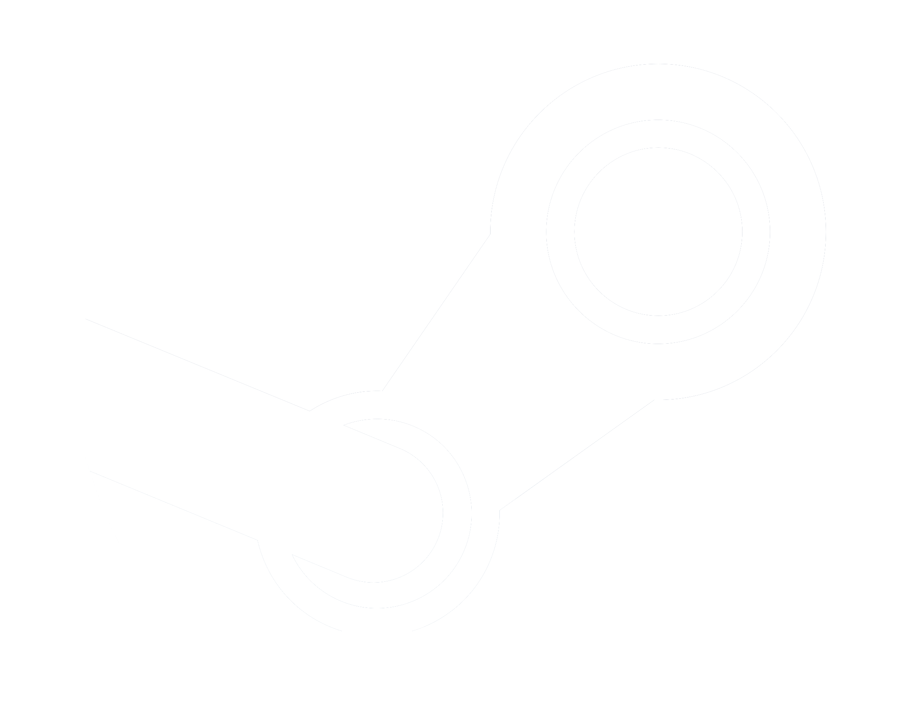<br/>
        <span style="background: linear-gradient(111deg,rgba(7, 25, 62, 1) 0%, rgba(19, 91, 142, 1) 100%); color:white; padding: 5px; border-radius: 5px;">Steam #07193E > #135B8E </span>
      </td>
      <td align="center">
        <br/>
        <span style="background-color:#0C7C14; color:white; padding: 5px; border-radius: 5px;">Xbox #0C7C14</span>
      </td>
      <td align="center">
        <br/>
        <span style="background-color:#000000; color:white; padding: 5px; border-radius: 5px;">Epic Games #000000</span>
      </td>
      <td align="center">
        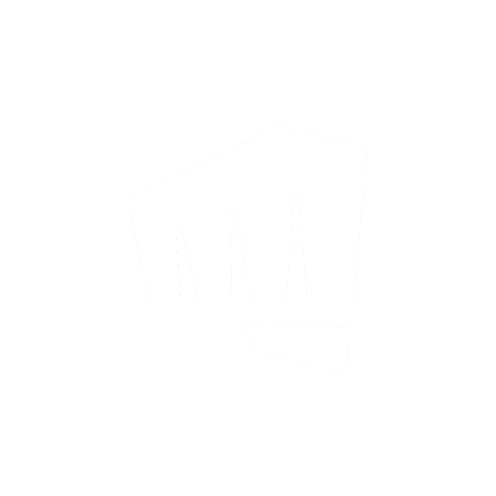<br/>
        <span style="background-color:#D3373A; color:white; padding: 5px; border-radius: 5px;">Riot Games #D3373A</span>
      </td>
    </tr>
    <tr>
      <td align="center">
        <br/>
        <span style="background-color:#669966; color:black; padding: 5px; border-radius: 5px;">Minecraft #669966</span>
      </td>
      <td align="center">
        <br/>
        <span style="background-color:#FFFFFF; color:black; padding: 5px; border-radius: 5px;">Rocket Leauge #FFFFFF</span>
      </td>
      <td align="center">
        <br/>
        <span style="background-color:#34A5AD; color:black; padding: 5px; border-radius: 5px;">Leauge of Legends #34A5AD</span>
      </td>
      <td align="center">
        <br/>
        <span style="background-color:#F47E1C; color:black; padding: 5px; border-radius: 5px;">PUBG #F47E1C</span>
      </td>
    </tr>
    <tr>
      <td align="center">
        <br/>
        <span style="background-color:#FF0006; color:white; padding: 5px; border-radius: 5px;">Hades #FF0006</span>
      </td>
      <td align="center">
        <br/>
        <span style="background-color:#58D4AF; color:black; padding: 5px; border-radius: 5px;">Hades II #58D4AF</span>
      </td>
      <td align="center">
        <br/>
        <span style="background-color:#F1BD6D; color:black; padding: 5px; border-radius: 5px;">Valheim #F1BD6D</span>
      </td>
          <td align="center">
        <br/>
        <span style="background-color:#000000; color:white; padding: 5px; border-radius: 5px;">Beat Saber #000000</span>
      </td>
    </tr>
    <tr>
    <td align="center">
        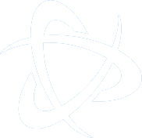<br/>
        <span style="background-color:#0074E0; color:white; padding: 5px; border-radius: 5px;">Battle Net #0074E0</span>
      </td>
    <td align="center">
        <br/>
        <span style="background-color:#272526; color:white; padding: 5px; border-radius: 5px;">TF2 #272526</span>
      </td>
      <td align="center">
        <br/>
        <span style="background-color:#DA6F01; color:black; padding: 5px; border-radius: 5px;">Satisfactory #DA6F01</span>
      </td>
      <td align="center">
        <br/>
        <span style="background-color:#D11CF4; color:white; padding: 5px; border-radius: 5px;">Supervive #D11CF4</span>
      </td>
    </tr>
  </table>
  </details>

<details>
<summary style="font-size: 1.5em; font-weight: 600">File Explorer</summary>

  <table>
    <tr>
      <td align="center">
        <br/>
        <span style="background-color:#888888; color:white; padding: 5px; border-radius: 5px;">C:\ #888888</span>
      </td>
      <td align="center">
        <br/>
        <span style="background-color:#888888; color:white; padding: 5px; border-radius: 5px;">D:\ #888888</span>
      </td>
      <td align="center">
        <br/>
        <span style="background-color:#888888; color:white; padding: 5px; border-radius: 5px;">E:\ #888888</span>
      </td>
      <td align="center">
        <br/>
        <span style="background-color:#888888; color:white; padding: 5px; border-radius: 5px;">Pc #888888</span>
      </td>
    </tr>
    <tr>
      <td align="center">
        <br/>
        <span style="background-color:#888888; color:white; padding: 5px; border-radius: 5px;">Downloads #888888</span>
      </td>
      <td align="center">
        <br/>
        <span style="background-color:#888888; color:white; padding: 5px; border-radius: 5px;">Documents #888888</span>
      </td>
      <td align="center">
        <br/>
        <span style="background-color:#888888; color:white; padding: 5px; border-radius: 5px;">Photos #888888</span>
      </td>
      <td align="center">
        <br/>
        <span style="background-color:#888888; color:white; padding: 5px; border-radius: 5px;">Videos #888888</span>
      </td>
    </tr>
    <tr>
      <td align="center">
        <br/>
        <span style="background-color:#888888; color:white; padding: 5px; border-radius: 5px;">Music #888888</span>
      </td>
      <td align="center">
        <br/>
        <span style="background-color:#888888; color:white; padding: 5px; border-radius: 5px;">New Folder #888888</span>
      </td>
      <td align="center">
        <br/>
        <span style="background-color:#888888; color:white; padding: 5px; border-radius: 5px;">New Window #888888</span>
      </td>
      <td align="center">
        <br/>
        <span style="background-color:#888888; color:white; padding: 5px; border-radius: 5px;">Rename #888888</span>
      </td>
        <tr>
      <td align="center">
        <br/>
        <span style="background-color:#888888; color:white; padding: 5px; border-radius: 5px;">Preview #888888</span>
      </td>
      <td align="center">
        <br/>
        <span style="background-color:#888888; color:white; padding: 5px; border-radius: 5px;">Properties #888888</span>
      </td>
    </tr>
    </tr>
  </table>
</details>

<details>
<summary style="font-size: 1.5em; font-weight: 600">Zoom</summary>
<table>
    <tr>
      <td align="center">
        <br/>
        <span style="color:white; padding: 5px; border-radius: 5px; ">Zoom Camera 
        <span style="opacity: 0.6;"> Transparent </span> </span>
      </td>
      <td align="center">
        <br/>
        <span style="color:white; padding: 5px; border-radius: 5px;">Zoom Chat 
        <span style="opacity: 0.6;"> Transparent </span></span>
      </td>
      <td align="center">
        <br/>
        <span style="color:white; padding: 5px; border-radius: 5px;">Zoom Mic 
        <span style="opacity: 0.6;"> Transparent </span></span>
      </td>
      <td align="center">
        <br/>
        <span style="color:white; padding: 5px; border-radius: 5px;">Zoom Participants
        <span style="opacity: 0.6;"> Transparent </span></span>
      </td>
    </tr>
    <tr>
    <td align="center">
        <br/>
        <span style="background-color:#54B957; color:white; padding: 5px; border-radius: 5px;">Zoom Share Screen #54B957</span>
      </td>
    </tr>
  </table>
</details>

<details>
<summary style="font-size: 1.5em; font-weight: 600">System Icons</summary>
<table>
    <tr>
      <td align="center">
        <br/>
        <span style="color:white; padding: 5px; border-radius: 5px; ">Left Grey
        <span style="opacity: 0.6;"> Transparent </span> </span>
      </td>
      <td align="center">
        <br/>
        <span style="color:white; padding: 5px; border-radius: 5px; ">Right Grey        
        <span style="opacity: 0.6;"> Transparent </span> </span>
      </td>
      <td align="center">
        <br/>
        <span style="color:white; padding: 5px; border-radius: 5px; ">Left White        
        <span style="opacity: 0.6;"> Transparent </span> </span>
      </td>
      <td align="center">
        <br/>
        <span style="color:white; padding: 5px; border-radius: 5px; ">Right White      
        <span style="opacity: 0.6;"> Transparent </span> </span>
      </td>
    </tr>
    <tr>
    <td align="center">
        <br/>
        <span style="color:white; padding: 5px; border-radius: 5px; ">Close
        <span style="opacity: 0.6;"> Transparent </span> </span>
      </td>
        <td align="center">
        <br/>
        <span style="color:white; padding: 5px; border-radius: 5px; ">Locked      
        <span style="opacity: 0.6;"> Transparent </span> </span>
      </td>
      </td>
        <td align="center">
        <br/>
        <span style="color:white; padding: 5px; border-radius: 5px; ">Unlcoked      
        <span style="opacity: 0.6;"> Transparent </span> </span>
      </td>
      </td>
        <td align="center">
        <br/>
        <span style="color:white; padding: 5px; border-radius: 5px; ">Menu      
        <span style="opacity: 0.6;"> Transparent </span> </span>
      </td>
    </tr>
    <tr>
      </td>
        <td align="center">
        <br/>
        <span style="color:white; padding: 5px; border-radius: 5px; ">Back      
        <span style="opacity: 0.6;"> Transparent </span> </span>
      </td>
    </tr>
  </table>
</details>

<details>
<summary style="font-size: 1.5em; font-weight: 600">Discord</summary>
<table>
    <tr>
      <td align="center">
        <br/>
        <span style="color:white; padding: 5px; border-radius: 5px; ">Deafend 
        <span style="opacity: 0.6;"> Transparent </span> </span>
      </td>
      <td align="center">
        <br/>
        <span style="color:white; padding: 5px; border-radius: 5px;">Undeafend
        <span style="opacity: 0.6;"> Transparent </span></span>
      </td>
      <td align="center">
        <br/>
        <span style="color:white; padding: 5px; border-radius: 5px;">Muted 
        <span style="opacity: 0.6;"> Transparent </span></span>
      </td>
      <td align="center">
        <br/>
        <span style="color:white; padding: 5px; border-radius: 5px;">Unmuted
        <span style="opacity: 0.6;"> Transparent </span></span>
      </td>
    </tr>
    <tr>
    <td align="center">
        <br/>
        <span style="color:white; padding: 5px; border-radius: 5px;">Hangup
        <span style="opacity: 0.6;"> Transparent </span></span>
      </td>
    </tr>
  </table>
</details>

<details>
<summary style="font-size: 1.5em; font-weight: 600">Spotify</summary>
<table>
    <tr>
    <td align="center">
        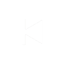<br/>
        <span style="color:white; padding: 5px; border-radius: 5px; ">Backward
        <span style="opacity: 0.6;"> Transparent </span> </span>
    </td>
    <td align="center">
        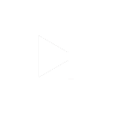<br/>
        <span style="color:white; padding: 5px; border-radius: 5px; ">Forward
        <span style="opacity: 0.6;"> Transparent </span> </span>
    </td>
    <td align="center">
        <br/>
        <span style="color:white; padding: 5px; border-radius: 5px; ">Pause
        <span style="opacity: 0.6;"> Transparent </span> </span>
    </td>
    <td align="center">
        <br/>
        <span style="color:white; padding: 5px; border-radius: 5px; ">Play
        <span style="opacity: 0.6;"> Transparent </span> </span>
    </td>
    </tr>
      <tr>
    <td align="center">
        <br/>
        <span style="color:white; padding: 5px; border-radius: 5px; ">Volume Down
        <span style="opacity: 0.6;"> Transparent </span> </span>
    </td>
    <td align="center">
        <br/>
        <span style="color:white; padding: 5px; border-radius: 5px; ">Volume Up
        <span style="opacity: 0.6;"> Transparent </span> </span>
    </td>
    <td align="center">
        <br/>
        <span style="color:white; padding: 5px; border-radius: 5px; ">Volume Mute
        <span style="opacity: 0.6;"> Transparent </span> </span>
    </td>
    <td align="center">
        <br/>
        <span style="color:white; padding: 5px; border-radius: 5px; ">Volume Mute Green
        <span style="opacity: 0.6;"> Transparent </span> </span>
    </td>
    </tr>
    <tr>
    <td align="center">
        <br/>
        <span style="color:white; padding: 5px; border-radius: 5px; ">Heart
        <span style="opacity: 0.6;"> Transparent </span> </span>
    </td>
    <td align="center">
        <br/>
        <span style="color:white; padding: 5px; border-radius: 5px; ">Heart Green
        <span style="opacity: 0.6;"> Transparent </span> </span>
    </td>
    <td align="center">
        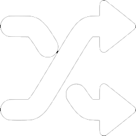<br/>
        <span style="color:white; padding: 5px; border-radius: 5px; ">Shuffle
        <span style="opacity: 0.6;"> Transparent </span> </span>
    </td>
    <td align="center">
        <br/>
        <span style="color:white; padding: 5px; border-radius: 5px; ">Shuffle Green
        <span style="opacity: 0.6;"> Transparent </span> </span>
    </td>
    </tr>
      <tr>
    <td align="center">
        <br/>
        <span style="color:white; padding: 5px; border-radius: 5px; ">Repeat None
        <span style="opacity: 0.6;"> Transparent </span> </span>
    </td>
    <td align="center">
        <br/>
        <span style="color:white; padding: 5px; border-radius: 5px; ">Repeat One
        <span style="opacity: 0.6;"> Transparent </span> </span>
    </td>
    <td align="center">
        <br/>
        <span style="color:white; padding: 5px; border-radius: 5px; ">Repeat All
        <span style="opacity: 0.6;"> Transparent </span> </span>
    </td>
    </tr>
      
  </table>
</details>

## Attribution:

- **Adobe/Arbi Photoshop Tools Pack/** — Icons by **Arbi Barbarona**

  - Facebook: [arbibarbarona](https://www.facebook.com/arbibarbarona)
  - Original `info.txt` included in the folder.

- **Discord/Discord Vanilla Icon Pack/** — Icons by **BreezyBat**
  - Twitch: [breezybat](https://twitch.tv/breezybat)
  - Original `info.txt` included in the folder.
  - _Modified by me to remove backgrounds for transparency._

> ⚠️ Most icons are intended for **personal use only**. Avoid redistributing without checking original sources.

# 🧑‍💻 VS Code Setup

This section covers my VS Code setup—focused on a minimalist, distraction-free coding environment.
It includes my theme, font choice, and extension list to keep everything clean, functional, and tailored for web development and scripting.

## Font

- Uses **Comic Code**: [Comic Code by Toshi Omagari](https://tosche.net/fonts/comic-code)
- Optional: swap for Fira Code, JetBrains Mono, etc. if unavailable.

## Install Extensions:

```bash
cat vscode/extensions.txt | xargs -n 1 code --install-extension
```

## Apply Settings:

Copy `vscode/settings.json` to:

- **Windows**: `%APPDATA%\Code\User\settings.json`
- **Mac/Linux**: `~/.config/Code/User/settings.json`

# 🖥️ Wallpaper Engine Setup

This setup uses **two dynamic wallpapers** that switch based on time:

This syncs my wallpapers with my day/night workflow, creating a subtle but effective mood shift.

## Wallpapers

1. **Swirl (Light Theme)**

   - [Steam Workshop ID: 2568658643](https://steamcommunity.com/sharedfiles/filedetails/?id=2568658643)

2. **Black (Dark Theme)**
   - [Steam Workshop ID: 2604686890](https://steamcommunity.com/sharedfiles/filedetails/?id=2604686890)

## Schedule

- **9:30 PM**: Switches to **Black** (Dark Theme)
- **7:00 AM**: Switches back to **Swirl** (Light Theme)

## Color Settings

### Swirl (Light Theme):

- **Background Color**: `#2476fe`
- **Color 1**: `#ffffff`
- **Color 2**: `#321ffe`

### Black (Dark Theme):

- **Background Color 1**: `#141414`
- **Background Color 2**: `#141414`
- **Particle Color**: `#4c98f6`
- **Line Color**: `#0066ff`

## Applying the Setup

1. **Download both wallpapers** via the provided Workshop links.
2. Replace your **Wallpaper Engine config** with the provided `config.json`:
   - Path: `C:/Program Files (x86)/Steam/steamapps/common/wallpaper_engine/config/config.json`
3. Restart **Wallpaper Engine** to apply.

> ⚠️ **Warning**: Replacing the config will overwrite your current Wallpaper Engine schedules and preferences.

# 📝 Notes

- This is a **work in progress** — I constantly refine and evolve the setup.
- Icons in Touch Portal are for **personal use only**.
- The Touch Portal **automatic page switching** feature only works on **Windows**.

# ❤️ Credits

Crafted by **Gabe** — a workspace built for speed, comfort, and dark mode aesthetics. Remix, borrow, or take inspiration freely. If you use it, I'd love to see how you make it your own!

Thank you to **Arbi Barbarona** and **BreezyBat** for your wonderful icons
