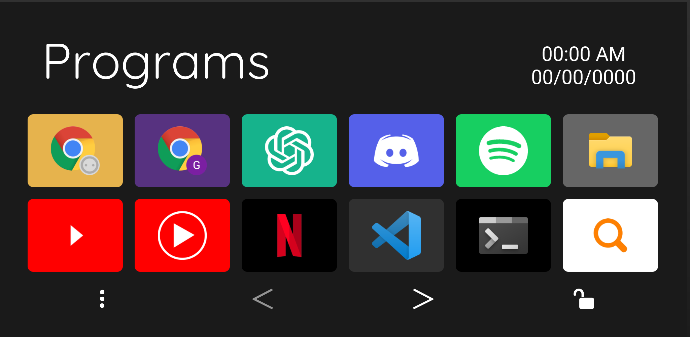
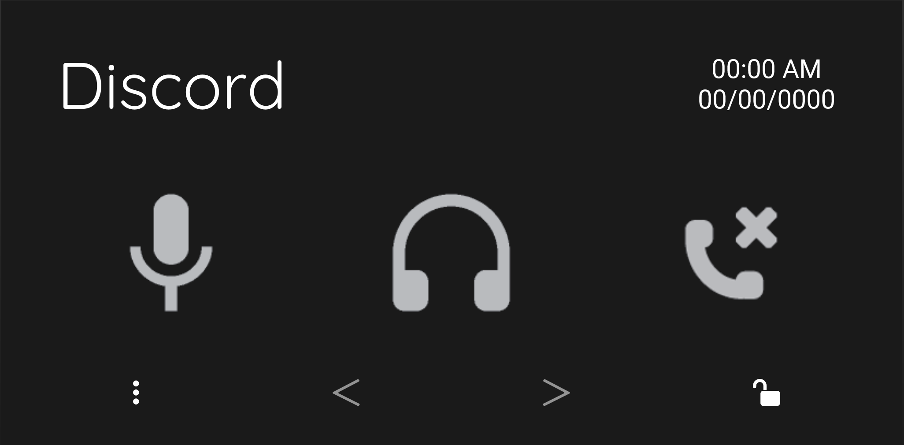
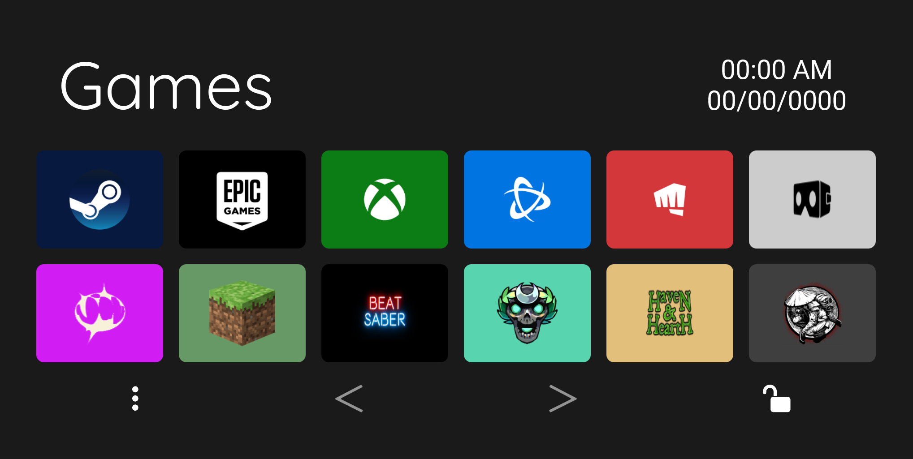

# 📁 GBE Dotfiles

This is my personal development environment — terminal themes, VS Code setup, Touch Portal macros, and more.

While this setup is highly personalized, parts of it may be useful to anyone looking to build their own modular, dark-mode-friendly workspace.

It is constantly being changed and is still a work in progress

## Contents

```
GBE-DOTFILES/
├── oh-my-posh/              # Shell & terminal config
│   └── gbe-theme.omp.json    # Oh My Posh theme
│
├─ touch-portal/             # Touch portal files
│   ├── touch-portal-pages/     # Touch portal pages
│   │   ├── Adobe Tools/          # Illustrator, Photoshop tools
│   │   ├── Coding Tools/         # JavaScript, Language switchers
│   │   ├── Discord/              # Voice and call controls
│   │   ├── File Explorer/        # Folder nav, drive shortcuts
│   │   ├── Games/                # Game launchers
│   │   ├── Main Menu/            # Navigation hub
│   │   ├── Programs/             # Most-used apps
│   │   ├── Spotify/              # Music controls
│   │   ├── Web Browser/          # Tab management + quick access
│   │   ├── Zoom/                 # Meeting controls
│   │   ├── gbe-all-pages.tpz2    # Full backup of all pages
│   │   └── gbe-clock.tpz2        # Standalone clock plugin page
│   └── touch-portal-icons/     # PNG imgs used for the buttons
│       ├── Adobe/                # Adobe apps & tools (includes 3rd-party Arbi set)
│       ├── Discord/              # Voice control icons (includes modified 3rd-party BreezyBat set)
│       ├── File Explorer/        # Navigation + drive icons
│       ├── Games/                # Launcher & game icons
│       ├── Icons/                # Arrows, locks, misc UI
│       ├── Internet/             # Browser functions & shortcuts
│       ├── Programs/             # App icons (VS Code, Slack, etc.)
│       ├── Spotify/              # Playback icons
│       └── Zoom/                 # Meeting controls
│
├── vscode/                 # Editor setup
│   ├── settings.json        # Font, theme, layout, etc.
│   └── extensions.txt       # List of installed extensions
│
└── README.md               # You're here!
```

# >\_ Terminal Prompt (Oh My Posh)

Oh My Posh is a prompt theme engine for any shell, designed to make your terminal more informative and visually appealing.

Download it here: [Oh My Posh](https://ohmyposh.dev/)

My theme focuses on dark mode compatibility with vibrant segments that highlight key info like the current directory, Git status, and time.

## Installing my theme

Download and find `gbe-theme.omp.json` in the `oh-my-posh` folder

To apply:

```bash
oh-my-posh init bash --config ~/path/to/gbe-theme.omp.json | source
```

## Structure


Segment Breakdown:

1. Time of command

2. Username & Hostname

3. Current directory

4. Git branch & status (if in a repo)

5. Execution time (for the last command)

## Git Branch and Status Color Legend

| **Color**     | **Trigger**                           | **Meaning**                                                    |
| ------------- | ------------------------------------- | -------------------------------------------------------------- |
| **Green**     | No changes / clean repo               | Everything is **up-to-date** and clean.                        |
| **Orange**    | Uncommitted changes (working/staging) | You’ve got **local changes** not staged or committed.          |
| **Purple**    | Ahead                                 | You have **local commits** to push.                            |
| **Dark Blue** | Behind                                | Remote has **commits to pull**.                                |
| **Red**       | Ahead _and_ behind                    | You’re **out of sync**—both local and remote have new commits. |

# 📱 Touch Portal Setup

Touch Portal is a macro control app that turns any phone or tablet into a customizable control deck for your PC.

Download it here: [Touch Portal](https://www.touch-portal.com/)

My setup focuses on workflow automation for common, repetitive tasks while providing a visual shortcut system to streamline daily workflow.

## Custom Pages Overview:

- **Programs** - Default page that opens when there isn't a designated page.

  - Access all of your favorite Programs at a touch

- **Web Browser** - Opens with Google Chrome. Manage tabs and access quick links:

  - New Tab New Window, Back, Refresh, Incognito Mode, and Close Tab controls.

  - Quick launch shortcuts for YouTube, YouTube Music, Netflix, Reddit, Amazon, and Twitch.

- **Coding Tools** – Opens with VS Code. Choose a language like HTML, CSS, JavaScript, etc.

  - **JavaScript** has full macros built out for declarations, loops, conditionals, methods, and array functions across two pages.

- **Discord** – Opens with Discord. Uses a plugin to handle mute, deafen, and call controls.

- **Spotify** – Opens with Spotify. Uses a plugin to auto-fill album art, song title, artist name, and control everything:

  - Play/pause, skip, rewind, volume, mute/unmute, heart toggle, shuffle, and repeat modes.

- **Adobe Tools** – Opens with Photoshop or Illustrator. Switch between Photoshop tools, Photoshop actions, and Illustrator tools for quick-access workflows.

- **Zoom** – Opens with Zoom. Offers meeting controls for mute, camera toggle, chat view, audience view, hang up, and join call.

- **Games** – Opens with Steam. Displays common game launchers and favorite game shortcuts.

  - Access your games quickly by selecting _Programs_ from the main page.

- **File Explorer** - Opened manually. Quick navigation for file management:

  - Adds functions as buttons like: New Folder, New Window, Rename, Preview pane, and Properties

  - Shortcuts to PC, Downloads, Documents, and Drives (C:, D:, E:)

- **Main menu** - Serves as a hub connecting all pages together

  - Can be accessed on any page by clicking the three vertical dots on the bottom left

## Navigation & Lock Logic:

- **Automatic page switching** takes you to the correct page when its corresponding window is active.

  - Only works on **Windows**.

- Tap the page title to return to the **Default Page**.

- Lock 🔒 / Unlock 🔓 buttons toggle whether the tablet stays on a page.

- Arrows (`<`, `>`) move between multi-page sections.

## Required Plugins:

- [Timezones Plugin (Clock)](https://www.christophecvb.com/touch-portal/plugins/timezones) — Displays live time and date on all pages.
- [Discord Plugin](https://github.com/spdermn02/TouchPortal_Discord_Plugin) — Controls mute, deafen, and calls.
- [Spotify Plugin](https://www.christophecvb.com/touch-portal/plugins/spotify) — Spotify playback controls.

## Screenshots:

<table>
  <tr>
    <td align="center">
      <br/>
      <strong>Programs</strong>
    </td>
    <td align="center">
      <br/>
      <strong>Web Browser</strong>
    </td>
  </tr>
  <tr>
    <td align="center">
      <br/>
      <strong>Discord</strong>
    </td>
    <td align="center">
      <br/>
      <strong>File Explorer</strong>
    </td>
  </tr>
  <tr>
    <td align="center">
      <br/>
      <strong>Games</strong>
    </td>
    <td align="center">
      <br/>
      <strong>Main Menu</strong>
    </td>
  </tr>
</table>

> **Note:** Some icons may appear distorted in the **Touch Portal Windows app**, but display correctly on **Android** and **iOS** devices.

# 🖼️ Touch Portal Icons

This repo includes a full suite of **Touch Portal icons**, grouped into folders by usage (Adobe, Games, Zoom, etc.). Most are custom or adapted for clarity and consistency.

## Attribution:

- **Adobe/Arbi Photoshop Tools Pack/** — Icons by **Arbi Barbarona**

  - Facebook: [arbibarbarona](https://www.facebook.com/arbibarbarona)
  - Original `info.txt` included in the folder.

- **Discord/Discord Vanilla Icon Pack/** — Icons by **BreezyBat**
  - Twitch: [breezybat](https://twitch.tv/breezybat)
  - Original `info.txt` included in the folder.
  - _Modified by me to remove backgrounds for transparency._

> ⚠️ Most icons are intended for **personal use only**. Avoid redistributing without checking original sources.

# 🧑‍💻 VS Code Setup

This section covers my VS Code setup—focused on a minimalist, distraction-free coding environment.
It includes my theme, font choice, and extension list to keep everything clean, functional, and tailored for web development and scripting.

## Font

- Uses **Comic Code**: [Comic Code by Toshi Omagari](https://tosche.net/fonts/comic-code)
- Optional: swap for Fira Code, JetBrains Mono, etc. if unavailable.

## Install Extensions:

```bash
cat vscode/extensions.txt | xargs -n 1 code --install-extension
```

## Apply Settings:

Copy `vscode/settings.json` to:

- **Windows**: `%APPDATA%\Code\User\settings.json`
- **Mac/Linux**: `~/.config/Code/User/settings.json`

# 🖥️ Wallpaper Engine Setup

This setup uses **two dynamic wallpapers** that switch based on time:

This syncs my wallpapers with my day/night workflow, creating a subtle but effective mood shift.

## Wallpapers

1. **Swirl (Light Theme)**

   - [Steam Workshop ID: 2568658643](https://steamcommunity.com/sharedfiles/filedetails/?id=2568658643)

2. **Black (Dark Theme)**
   - [Steam Workshop ID: 2604686890](https://steamcommunity.com/sharedfiles/filedetails/?id=2604686890)

## Schedule

- **9:30 PM**: Switches to **Black** (Dark Theme)
- **7:00 AM**: Switches back to **Swirl** (Light Theme)

## Color Settings

### Swirl (Light Theme):

- **Background Color**: `#2476fe`
- **Color 1**: `#ffffff`
- **Color 2**: `#321ffe`

### Black (Dark Theme):

- **Background Color 1**: `#141414`
- **Background Color 2**: `#141414`
- **Particle Color**: `#4c98f6`
- **Line Color**: `#0066ff`

## Applying the Setup

1. **Download both wallpapers** via the provided Workshop links.
2. Replace your **Wallpaper Engine config** with the provided `config.json`:
   - Path: `C:/Program Files (x86)/Steam/steamapps/common/wallpaper_engine/config/config.json`
3. Restart **Wallpaper Engine** to apply.

> ⚠️ **Warning**: Replacing the config will overwrite your current Wallpaper Engine schedules and preferences.

# 📝 Notes

- This is a **work in progress** — I constantly refine and evolve the setup.
- Icons in Touch Portal are for **personal use only**.
- The Touch Portal **automatic page switching** feature only works on **Windows**.

# ❤️ Credits

Crafted by **Gabe** — a workspace built for speed, comfort, and dark mode aesthetics. Remix, borrow, or take inspiration freely. If you use it, I'd love to see how you make it your own!

Thank you to **Arbi Barbarona** and **BreezyBat** for your wonderful icons
