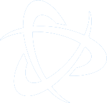

# Icon Preview & Color Guide

This guide provides a visual preview of all icons, along with recommended background colors for each one.  
It serves as both a style reference and a quick way to ensure consistency across your Touch Portal layout.

Icons are grouped by category, and hex codes are included for easy customization.  
Use this guide to stay visually organized, or tweak it to match your personal theme.

# Programs

<table>
  <tr>
    <td align="center">
         
        Chrome #E6B34D
     </td>
    <td align="center">
         
        ChatGPT #16B38C
    </td>
    <td align="center">
         
        Discord #5560E9
    </td>
    <td align="center">
         
        Spotify #17CF61
    </td>
  </tr>
  <tr>
    <td align="center">
         
        File Explorer #666666
    </td>
    <td align="center">
         
        VS Code (Color) #666666
    </td>
    <td align="center">
         
        VS Code (White) #2EA3F1
    <td align="center">
         
         Terminal #000000
    </td>
  </tr>
  <tr>
    <td align="center">
         
        Everything #FFFFFF
    </td>
    <td align="center">
         
        Touch Portal #1E1E1E
    </td>
    <td align="center">
         
        Firefox #1A3399
    <td align="center">
         
        Arc #FFFFFF
    </td>
  </tr>
  <tr>
    <td align="center">
         
        Slack #FFFFFF
    </td>
    <td align="center">
         
        Zoom #518EF7
    </td>
    <td align="center">
         
        Steel Series #FF511B
    <td align="center">
         
        Logitech #FFFFFF
    </td>
  </tr>
</table>

# Adobe

<table>
  <tr>
    <td align="center">
         
        Photoshop #001733
     </td>
    <td align="center">
         
        Illustrator #310101
     </td>
    <td align="center">
         
        Xd #450035
     </td>
    <td align="center">
         
        Indesign #72172E
     </td>
  </tr>
  </table>

# Internet

### Web Shortcuts

<table>
  <tr>
    <td align="center">
         
        Amazon #F79400
     </td>
    <td align="center">
         
        Gmail #ffffff
     </td>
    <td align="center">
         
        Netflix #000000
     </td>
    <td align="center">
         
        Reddit #FF3F18
     </td>
     </tr>
  <tr>
    <td align="center">
         
        Twitch #6C2498
     </td>
    <td align="center">
         
        Youtube #FF0000
     </td>
    <td align="center">
         
        Youtube Music #FF0000
     </td>
     </tr>
  </table>

### Web Controls

  <table>
    <tr>
      <td align="center">
         
        New Tab #888888
      </td>
      <td align="center">
         
        New Window #888888
      </td>
      <td align="center">
         
        Back #888888
      </td>
      <td align="center">
         
        Refresh #888888
      </td>
    </tr>
    <tr>
      <td align="center">
         
        Incognito #888888
      </td>
      <td align="center">
         
        Close #888888
      </td>
    </tr>
  </table>

# Games

  <table>
    <tr>
      <td align="center">
         
        Steam #07193E > #135B8E 
      </td>
      <td align="center">
         
        Xbox #0C7C14
      </td>
      <td align="center">
         
        Epic Games #000000
      </td>
      <td align="center">
         
        Riot Games #D3373A
      </td>
    </tr>
    <tr>
      <td align="center">
         
        Minecraft #669966
      </td>
      <td align="center">
         
        Rocket Leauge #FFFFFF
      </td>
      <td align="center">
         
        Leauge of Legends #34A5AD
      </td>
      <td align="center">
         
        PUBG #F47E1C
      </td>
    </tr>
    <tr>
      <td align="center">
         
        Hades #FF0006
      </td>
      <td align="center">
         
        Hades II #58D4AF
      </td>
      <td align="center">
         
        Valheim #F1BD6D
      </td>
          <td align="center">
         
        Beat Saber #000000
      </td>
    </tr>
    <tr>
    <td align="center">
         
        Battle Net #0074E0
      </td>
    <td align="center">
         
        TF2 #272526
      </td>
      <td align="center">
         
        Satisfactory #DA6F01
      </td>
      <td align="center">
         
        Supervive #D11CF4
      </td>
    </tr>
  </table>

# File Explorer

  <table>
    <tr>
      <td align="center">
         
        C:\ #888888
      </td>
      <td align="center">
         
        D:\ #888888
      </td>
      <td align="center">
         
        E:\ #888888
      </td>
      <td align="center">
         
        Pc #888888
      </td>
    </tr>
    <tr>
      <td align="center">
         
        Downloads #888888
      </td>
      <td align="center">
         
        Documents #888888
      </td>
      <td align="center">
         
        Photos #888888
      </td>
      <td align="center">
         
        Videos #888888
      </td>
    </tr>
    <tr>
      <td align="center">
         
        Music #888888
      </td>
      <td align="center">
         
        New Folder #888888
      </td>
      <td align="center">
         
        New Window #888888
      </td>
      <td align="center">
         
        Rename #888888
      </td>
        <tr>
      <td align="center">
         
        Preview #888888
      </td>
      <td align="center">
         
        Properties #888888
      </td>
      <td align="center">
         
        Close Icon #888888
      </td>
    </tr>
    </tr>
  </table>

# Zoom

<table>
    <tr>
      <td align="center">
         
        Zoom Camera 
         Transparent  
      </td>
      <td align="center">
         
        Zoom Chat 
         Transparent 
      </td>
      <td align="center">
         
        Zoom Mic 
         Transparent 
      </td>
      <td align="center">
         
        Zoom Chat 
         Transparent 
      </td>
    </tr>
    <tr>
    <td align="center">
         
        Zoom Share Screen #54B957
      </td>
    </tr>
  </table>

# System Icons

<table>
    <tr>
      <td align="center">
         
        Left Grey
         Transparent  
      </td>
      <td align="center">
         
        Right Grey        
         Transparent  
      </td>
      <td align="center">
         
        Left White        
         Transparent  
      </td>
      <td align="center">
         
        Right White      
         Transparent  
      </td>
    </tr>
    <tr>
    <td align="center">
         
        Close
         Transparent  
      </td>
        <td align="center">
         
        Locked      
         Transparent  
      </td>
      </td>
        <td align="center">
         
        Unlcoked      
         Transparent  
      </td>
    </tr>
  </table>

# Discord

<table>
    <tr>
    <td align="center">
         
        Deafend
         Transparent  
      </td>
        <td align="center">
         
        Undeafend      
         Transparent  
      </td>
      </td>
        <td align="center">
         
        Muted      
         Transparent  
      </td>
      </td>
        <td align="center">
         
        Unmuted      
         Transparent  
      </td>
      <table>
    <tr>
    <td align="center">
         
        Hang up
         Transparent  
      </td>
    </tr>
  </table>
    </tr>
  </table>

# Spotify

<table>
    <tr>
    <td align="center">
         
        Backward
         Transparent  
    </td>
    <td align="center">
         
        Forward
         Transparent  
    </td>
    <td align="center">
         
        Pause
         Transparent  
    </td>
    <td align="center">
         
        Play
         Transparent  
    </td>
    </tr>
      <tr>
    <td align="center">
         
        Volume Down
         Transparent  
    </td>
    <td align="center">
         
        Volume Up
         Transparent  
    </td>
    <td align="center">
         
        Volume Mute
         Transparent  
    </td>
    <td align="center">
         
        Volume Mute Green
         Transparent  
    </td>
    </tr>
    <tr>
    <td align="center">
         
        Heart
         Transparent  
    </td>
    <td align="center">
         
        Heart Green
         Transparent  
    </td>
    <td align="center">
         
        Shuffle
         Transparent  
    </td>
    <td align="center">
         
        Shuffle Green
         Transparent  
    </td>
    </tr>
      <tr>
    <td align="center">
         
        Repeat None
         Transparent  
    </td>
    <td align="center">
         
        Repeat One
         Transparent  
    </td>
    <td align="center">
         
        Repeat All
         Transparent  
    </td>
    </tr>
      
  </table>
