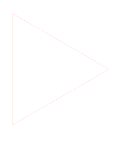

# Recomended colors

This is just my personal reomendation for the background colors I use with the icons feel free to adjust as needed

WIP

# Programs

<table>
  <tr>
    <td align="center">
         
        Chrome #E6B34D
     </td>
    <td align="center">
         
        ChatGPT #16B38C
    </td>
    <td align="center">
         
        Discord #5560E9
    </td>
    <td align="center">
         
        Spotify #17CF61
    </td>
  </tr>
  <tr>
    <td align="center">
         
        File Explorer #666666
    </td>
    <td align="center">
         
        VS Code (Color) #666666
    </td>
    <td align="center">
         
        VS Code (White) #2EA3F1
    <td align="center">
         
         Terminal #000000
    </td>
  </tr>
  <tr>
    <td align="center">
         
        Everything #FFFFFF
    </td>
    <td align="center">
         
        Touch Portal #1E1E1E
    </td>
    <td align="center">
         
        Firefox #1A3399
    <td align="center">
         
        Arc #FFFFFF
    </td>
  </tr>
  <tr>
    <td align="center">
         
        Slack #FFFFFF
    </td>
    <td align="center">
         
        Zoom #518EF7
    </td>
    <td align="center">
         
        Steel Series #FF511B
    <td align="center">
         
        Logitech #FFFFFF
    </td>
  </tr>
</table>

# Adobe

<table>
  <tr>
    <td align="center">
         
        Photoshop #001733
     </td>
    <td align="center">
         
        Illustrator #310101
     </td>
    <td align="center">
         
        Xd #450035
     </td>
    <td align="center">
         
        Indesign #72172E
     </td>
  </tr>
  </table>

# Internet

### Web Shortcuts

<table>
  <tr>
    <td align="center">
         
        Amazon #F79400
     </td>
    <td align="center">
         
        Gmail #ffffff
     </td>
    <td align="center">
         
        Netflix #000000
     </td>
    <td align="center">
         
        Reddit #FF3F18
     </td>
     </tr>
  <tr>
    <td align="center">
         
        Twitch #6C2498
     </td>
    <td align="center">
         
        Youtube #FF0000
     </td>
    <td align="center">
         
        Youtube Music #FF0000
     </td>
     </tr>
  </table>

### Web Controls

  <table>
    <tr>
      <td align="center">
         
        New Tab #888888
      </td>
      <td align="center">
         
        New Window #888888
      </td>
      <td align="center">
         
        Back #888888
      </td>
      <td align="center">
         
        Refresh #888888
      </td>
    </tr>
    <tr>
      <td align="center">
         
        Incognito #888888
      </td>
      <td align="center">
         
        Close #888888
      </td>
    </tr>
  </table>

# Icons

# Discord

# File Explorer

# Games

# Spotify

# Zoom
